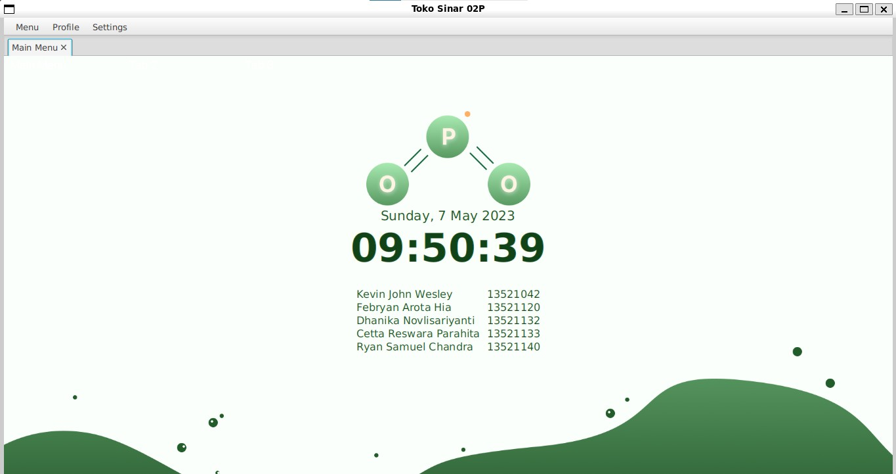

# Tugas Besar 2: Manajemen Usaha BNMO IF2210 Pemrograman Berorientasi Objek
Setelah gagal pada bisnis mereka sebelumnya, Indra dan Doni ingin membuka bisnis baru yang mencakup banyak product seperti restoran makanan, kafe, toko DIY, apotik dan sebagainya.
Untuk menopang bisnis mereka ini, mereka ingin menggunakan BNMO sebagai sistem POS (Point of Sales). Akan tetapi, BNMO belum memiliki fitur POS yang mereka inginkan. Oleh karena itu,
Indra dan Doni ingin meminta kalian, mahasiswa IF’ 21, untuk menambahkan fitur baru pada BNMO agar mereka dapat menjalankan bisnis baru mereka dengan lancar.


# Dependencies
1. Java ver 11 or above
2. JavaFX ver 18
3. ControlsFX version 11.0
4. JUnit Jupiter testing ver 5.8.1
5. JSON-Simple library ver 1.1.1
6. JAXP API version 1.4.5
7. Jackson Databind Library ver 2.12.5 
8. Xerces XML Parser ver 2.12.1
9. Jackson Dataformat XML ver 2.12.5
10. JAXB API version 2.3.1
11. FontAwesomeFX ver 9.1.2
12. Lombok Library ver 1.18.26
13. iTextPDF Libary ver 5.5.13

# How To Run
1. Clone this github
2. Build the gradle project <br>
    a. Go to build.gradle and click the reload build gradle button <br>
    b. Go to command line and in the root project type `gradle clean build` <br>
3. Run the program with `gradle run`

# Project Structure
```
└───src
    ├───dataStore
    │   ├───dataStore1
    │   │       bill.json
    │   │       customer.json
    │   │       fixedBill.json
    │   │       plugin.json
    │   │       product.json
    │   │
    │   └───dataStore2
    │           bill.json
    │           customer.json
    │           fixedBill.json
    │           plugin.json
    │           product.json
    │
    ├───img
    │       batangpengaduk.jpg
    │       cawanpetri.jpg
    │       deactivate.png
    │       gelasbeker.jpg
    │       gelasbeker100ml.jpg
    │       gelasbeker25ml.jpg
    │       gelasbeker50ml.jpg
    │       Home.png
    │       homescreen.jpg
    │       illustration1.png
    │       jaslab.jpg
    │       kacamata.jpg
    │       kakitiga.jpg
    │       kertaslakmus.jpg
    │       labuerlenmeyer.png
    │       logo.png
    │       masker.jpeg
    │       mortar.jpg
    │       pipet.jpg
    │       placeholderimg.png
    │       pycnometer250ml.jpg
    │       pycnometer25ml.jpg
    │       pycnometer50ml.jpg
    │       pycnometer5ml.jpg
    │       raktabungreaksi.jpg
    │       sarungtangan.jpg
    │       tabungreaksi.jpg
    │       upgradeToVIP.png
    │
    ├───lib
    │       pluginLineBarChart-1.0-SNAPSHOT.jar
    │       pluginPieChart-1.0-SNAPSHOT.jar
    │
    ├───main
    │   ├───java
    │   │   └───com
    │   │       └───o2pjualan
    │   │           │   Main.java
    │   │           │
    │   │           ├───Classes
    │   │           │       Bill.java
    │   │           │       Bills.java
    │   │           │       Controller.java
    │   │           │       Customer.java
    │   │           │       Customers.java
    │   │           │       FileController.java
    │   │           │       FileManager.java
    │   │           │       FixedBill.java
    │   │           │       FixedBills.java
    │   │           │       JSONController.java
    │   │           │       Member.java
    │   │           │       OBJController.java
    │   │           │       Pair.java
    │   │           │       Plugin.java
    │   │           │       pluginChartController.java
    │   │           │       PluginManager.java
    │   │           │       Plugins.java
    │   │           │       Product.java
    │   │           │       Products.java
    │   │           │       SalesReport.java
    │   │           │       VIP.java
    │   │           │       XMLController.java
    │   │           │       XMLReader.java
    │   │           │
    │   │           ├───GUI
    │   │           │       activateMembership.java
    │   │           │       addItemCatalog.java
    │   │           │       AlertGUI.java
    │   │           │       basePlugin.java
    │   │           │       BillGUI.java
    │   │           │       catalogMenu.java
    │   │           │       clickedHistory.java
    │   │           │       dataStoreSettings.java
    │   │           │       deactivateMembership.java
    │   │           │       editCatalogMenu.java
    │   │           │       history.java
    │   │           │       itemtoBill.java
    │   │           │       mainMenu.java
    │   │           │       pluginSettings.java
    │   │           │       report.java
    │   │           │       signUp.java
    │   │           │       upgradeMembership.java
    │   │           │
    │   │           └───style
    │   │               │   style.css
    │   │               │
    │   │               └───font
    │   │                       Inter-Black.ttf
    │   │                       Inter-Bold.ttf
    │   │                       Inter-ExtraBold.ttf
    │   │                       Inter-ExtraLight.ttf
    │   │                       Inter-Light.ttf
    │   │                       Inter-Medium.ttf
    │   │                       Inter-Regular.ttf
    │   │                       Inter-SemiBold.ttf
    │   │                       Inter-Thin.ttf
    │   │                       Inter-VariableFont_slnt,wght.ttf
    │   │
    │   └───resources
    ├───pdf
    │   ├───fixedBill
    │   │       2001_(1) Jeje.pdf
    │   │       2002_(2) Jaja.pdf
    │   │       2003_(3) Juju.pdf
    │   │
    │   └───report
    │           2023-05-07_17-32-06_salesReport.pdf
    │           2023-05-07_17-37-16_salesReport.pdf
    │           2023-05-07_17-37-55_salesReport.pdf
    │           2023-05-07_17-39-38_salesReport.pdf
    │           2023-05-07_17-40-13_salesReport.pdf
    │           2023-05-07_17-43-03_salesReport.pdf
    │
    └───test
        ├───java
        └───resources

```
## Author
| NIM  | Nama |
| ------------- | ------------- |
| 13521042 | Kevin John Wesley Hutabarat |
| 13521120 | Febryan Arota Hia |
| 13521132 | Dhanika Novlisariyanti |
| 13521133 | Cetta Reswara Parahita |
| 13521140 | Ryan Samuel Chandra |
